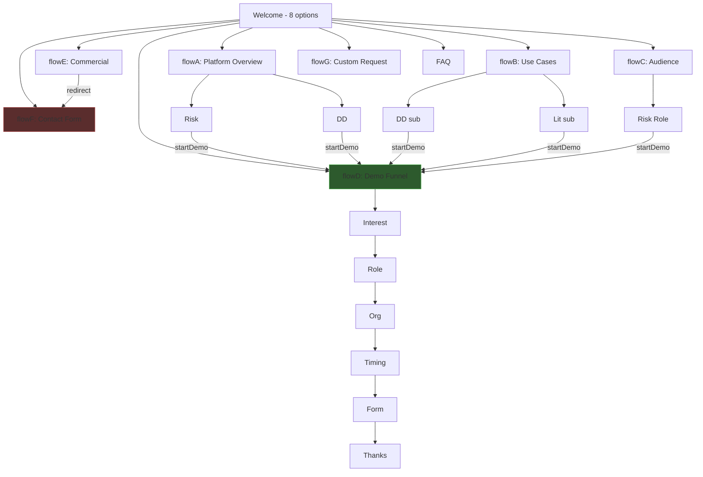
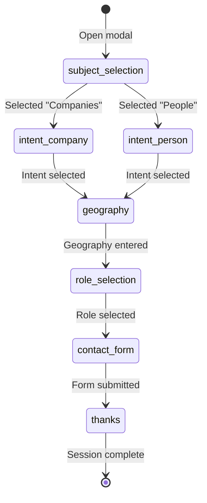

# DeepSearch Chatbot — Full Architectural Audit

> **Scope**: Product logic, conversational flow, state management, UX design, and architecture  
> **Date**: 2026-05-13  
> **Verdict**: The MVP operates as a **service-routing assistant**, not a **progressive lead qualification funnel**.

---

## 1. Product Logic Misalignment

### 1.1 Current Behavior: Service Router

The welcome screen ([welcome.js](file:///c:/test/current/Deepsearch-chatbott-FE/src/flows/welcome.js)) presents **8 top-level options** that route users into **isolated informational silos**:

| Option | What it does | Problem |
|--------|-------------|---------|
| Panoramica piattaforma | Routes to flowA (product features) | **Educates**, doesn't qualify |
| Casi d'uso | Routes to flowB (use case catalog) | **Recommends services**, doesn't filter intent |
| A chi si rivolge | Routes to flowC (persona matching) | **Profiles** user but doesn't feed into funnel |
| Richiedi demo | Jumps directly to flowD qualification | Only linear path to conversion |
| Informazioni commerciali | Routes to flowE → immediately redirects to flowF | **Dead-end redirect** |
| Contatta il team | Routes to flowF (generic contact form) | **Bypasses all qualification** |
| Altro | Routes to flowG (freetext) | Collects text, then generic form |
| FAQ | Static FAQ display | No funnel integration |

### 1.2 Why This Contradicts the Supervisor's Intent

The supervisor's expected flow is a **single linear funnel**:

```
Subject (Company/Person) → Intent → Geography → Role → Contact Form (with all answers)
```

The current system is a **hub-and-spoke menu** where:

1. **Most paths bypass qualification entirely** — flowA, flowE, flowF lead to forms with zero context
2. **User intent is asked at the wrong point** — flowD asks "area of interest" AFTER the user already chose a service in flowA/B/C
3. **Choices don't compound** — selecting "Due Diligence" in flowA, then clicking "Richiedi demo" starts flowD fresh, re-asking interest
4. **The form is the escape hatch, not the destination** — every terminal node pushes toward a form, making it feel like a redirect wall

### 1.3 Root Causes

| Problem | Root Cause |
|---------|-----------|
| Service routing instead of qualification | Welcome screen designed as a **sitemap** (8 options), not a **first qualifying question** |
| Choices ignored downstream | `startDemoFlow()` only carries `interest`/`role` from the CTA action object, not from flow history |
| Every path leads to same form | Terminal nodes in flowA/B/C all use `{ type: 'startDemo' }` which resets to flowD |
| No progressive narrowing | Flows are **parallel silos**, not **sequential stages** |

---

## 2. Conversation State Management Audit

### 2.1 State Architecture

Two independent stores exist — this is the first red flag:

| Store | Location | Purpose | Active? |
|-------|----------|---------|---------|
| `sessionStore` | [sessionStore.js](file:///c:/test/current/Deepsearch-chatbott-FE/src/store/sessionStore.js) | Screen navigation, qualification, lead data | **YES** — used by Modal/Panel |
| `chatStore` | [chatStore.js](file:///c:/test/current/Deepsearch-chatbott-FE/src/store/chatStore.js) | Messages, userData, flow steps | **DEAD** — referenced only by legacy ChatWindow/ChatModal |

The active system (`sessionStore`) has:
- `screen` — current screen ID
- `history[]` — navigation breadcrumb stack  
- `qualification{}` — accumulated qual data
- `lead{}` — form submission data

### 2.2 Critical State Bugs

#### Bug 1: Qualification Data Overwrites

In [Panel.jsx](file:///c:/test/current/Deepsearch-chatbott-FE/src/components/Panel.jsx#L20-L35), choices write to `qualification` using `setQual()`:

```js
if (screen === 'flowD_interest') setQual({ interest: choice.label });
if (screen === 'flowF')          setQual({ interest: choice.label }); // OVERWRITES!
if (screen === 'flowB_dd')       setQual({ interest: choice.label }); // OVERWRITES!
```

The `interest` key is overwritten by **3 different screens**. If a user goes flowB → flowB_dd → startDemo, the `interest` is set to the flowB_dd sub-choice, then **re-set** when flowD_interest renders.

#### Bug 2: `startDemoFlow()` Partially Skips Steps But Doesn't Carry Full Context

From [sessionStore.js L41-63](file:///c:/test/current/Deepsearch-chatbott-FE/src/store/sessionStore.js#L41-L63):

```js
startDemoFlow: ({ interest, role, ... } = {}) => set((s) => {
    let nextScreen = 'flowD_interest';
    const newQual = { ...s.qualification, sourceFlow, sourceScreen };
    if (interest) {
        newQual.interest = interest;
        nextScreen = 'flowD_role'; // skips interest step
    }
    if (role) {
        newQual.role = role;
        nextScreen = 'flowD_org'; // skips role step
    }
    ...
});
```

This is **partially smart** — it skips already-answered steps. But:
- It only works for `interest` and `role`, not for geography, subject type, or org
- The data carried comes from **hardcoded CTA action objects** in flow files, not from accumulated session state
- Previous choices from flowA/B/C **outside** the CTA action are lost

#### Bug 3: Form Submission Doesn't Include Qualification

In [Panel.jsx L44-53](file:///c:/test/current/Deepsearch-chatbott-FE/src/components/Panel.jsx#L44-L53):

```js
const handleFormSubmit = (formData) => {
    setLead(formData);  // Only form fields — no qualification data merged
    navigate('flowD_thanks');
};
```

And in [DemoForm.jsx](file:///c:/test/current/Deepsearch-chatbott-FE/src/components/DemoForm.jsx), `onSubmit(form)` sends only the form's own fields. The `qualification` object is **never merged into the submission payload**.

> [!CAUTION]
> **The qualification data (interest, role, org, timing, geoArea, function) is collected but NEVER included in the final form submission.** The lead receives contact info only — zero qualification signals reach the backend.

#### Bug 4: `open_modal()` Resets All State

From [sessionStore.js L11](file:///c:/test/current/Deepsearch-chatbott-FE/src/store/sessionStore.js#L11):

```js
open_modal: () => set({ open: true, screen: 'welcome', history: [], qualification: {}, lead: {} }),
```

Every time the modal opens, **all qualification and lead data is destroyed**. If a user closes and reopens, everything is lost.

### 2.3 State Persistence Summary

| Signal | Collected? | Persisted Across Steps? | Included in Form? | Sent to Backend? |
|--------|-----------|------------------------|-------------------|-----------------|
| Interest area | ✅ | ⚠️ Overwritten by multiple screens | ❌ | ❌ |
| Role | ✅ | ✅ Pre-fills form field only | ⚠️ As text input, not structured | ❌ |
| Organization type | ✅ | ✅ In qualification | ❌ | ❌ |
| Timing | ✅ | ✅ In qualification | ❌ | ❌ |
| Source flow | ✅ | ✅ In qualification | ❌ | ❌ |
| Geography | ✅ (flowG only) | ✅ In qualification | ❌ | ❌ |
| Subject type (Company/Person) | ❌ Not asked | N/A | N/A | N/A |
| Custom request text | ✅ (flowG) | ✅ In lead | ❌ Not in demo form | ❌ |

---

## 3. Funnel Architecture Analysis

### 3.1 Current Architecture Type: **Hardcoded FSM with Implicit State**

```
Architecture = Static Screen Graph + Zustand Store + Manual Transition Logic
```

- **Not a true FSM** — no formal state machine, no transition guards, no state validation
- **Not prompt-driven** — no LLM involvement, purely deterministic
- **Partially stateful** — `qualification` accumulates data, but transitions don't read it
- **Screen-centric, not data-centric** — navigation is by screen ID, not by qualification progress

### 3.2 Why This Doesn't Fit the Business Objective

The supervisor wants a **progressive qualification funnel** — a system where:
1. Each step narrows the user's intent
2. Previous answers determine the next question
3. All signals accumulate into a final payload
4. The form is the culmination, not an interrupt

The current architecture is a **content browsing system** with forms attached as exit points. The flow graph looks like:



**Problem**: flowA, flowB, flowC are **informational branches** that eventually funnel into flowD or flowF. They don't progressively qualify — they educate, then dump to a form.

---

## 4. UX & Conversational Design Problems

### 4.1 User Feels Railroaded

| Moment | What Happens | User Perception |
|--------|-------------|-----------------|
| Welcome screen | 8 options — overwhelming | "This is a menu, not a conversation" |
| After reading flowA_risk | Only options: "Explore use cases" or "Request demo" | "It's pushing me to the demo regardless of what I read" |
| flowE (commercial info) | All 3 options redirect to flowF or demo | "There's no actual commercial info here" |
| flowB_dd sub-choice | All 5 sub-options (Supplier/Client/Partner/Target/Other) go to same `flowB_dd_sub` | "My choice didn't matter" |
| Any terminal node | "Richiedi demo" + "Contatta il team" | "Every road leads to the same form" |

### 4.2 Flow Ignores Intent

When a user selects "Analisi del rischio" in flowA, they get a paragraph about risk analysis, then two CTAs. The system **never asks**:
- What kind of risk? (Financial, operational, reputational)
- About companies or people?
- In which geography?
- What's the urgency?

Instead, it shows an info blurb and offers "demo" or "explore more." The informational content is **static** and **doesn't adapt to prior selections**.

### 4.3 Questions Are Disconnected

The demo funnel (flowD) asks Interest → Role → Org → Timing → Form. But:
- If the user already expressed interest through flowA/B/C, they're asked again
- The geographic question is **only in flowG** (custom requests), not in the main funnel
- The **subject type** (Company vs Person) — the supervisor's #1 qualifying question — **doesn't exist anywhere**

### 4.4 Form Appears Too Early or Without Context

- flowF: 1 click (nature of request) → form. No qualification at all.
- flowE: Immediately redirects to flowF's form
- Direct "Richiedi demo" from welcome: Goes to flowD_interest, which is fine but skips the supervisor's intended Company/Person filter

---

## 5. Gap Analysis: Current vs Expected

| # | Current Behavior | Expected Behavior | Root Cause | Severity | Fix |
|---|-----------------|-------------------|-----------|----------|-----|
| 1 | Welcome shows 8-option menu (sitemap) | Welcome asks first qualifying Q: "Companies or People?" | Designed as content browser | 🔴 Critical | Replace welcome with Step 1 of funnel |
| 2 | No Company/Person subject filter exists | Step 1 should be subject type selection | Never implemented | 🔴 Critical | Add subject type as first screen |
| 3 | Intent asked inside flowD only | Intent should be Step 2, dynamic based on Step 1 | flowD is isolated from other flows | 🔴 Critical | Move intent to main funnel |
| 4 | Geographic area only in flowG (as choices) | Step 3: free-text geographic input for all paths | Only implemented for custom requests | 🔴 Critical | Add geography step to main funnel |
| 5 | Role/function in flowC and flowD separately | Step 4: role selection (existing implementation) | Duplicated across flows | 🟡 Medium | Consolidate into funnel |
| 6 | Qualification data NOT in form payload | Form must contain ALL previous answers | `handleFormSubmit` only saves form fields | 🔴 Critical | Merge qualification into submission |
| 7 | flowA/B/C are info silos with demo exits | Should not exist as separate entry points | Designed as content sections | 🟡 Medium | Deprecate or make secondary |
| 8 | `startDemoFlow()` only carries interest/role | Should carry full accumulated context | Hardcoded partial skip logic | 🟡 Medium | Refactor to read full qualification state |
| 9 | flowB sub-choices all go to same screen | Sub-choices should affect qualification signals | All targets point to same screen ID | 🟠 High | Map sub-choices to qualification data |
| 10 | flowE is a dead-end redirect | Commercial info should feed into qualification | No content, just redirects | 🟡 Medium | Remove or integrate |
| 11 | `open_modal()` resets all state | Should preserve or explicitly warn | Hard reset in store action | 🟠 High | Remove blind reset |
| 12 | Two separate stores (chatStore + sessionStore) | Single source of truth | Legacy code not removed | 🟡 Medium | Remove chatStore |
| 13 | Legacy ChatWindow/ChatModal/data/flows/*.json exist | Should be cleaned up | Previous architecture not removed | 🟡 Medium | Delete dead code |
| 14 | Free-text input in flowG doesn't feed into form | Free-text should appear as note in final payload | `customRequestText` stored in lead but not merged | 🟠 High | Merge lead + qualification |
| 15 | No backend API call on form submit | Form data must be POSTed to backend | `handleFormSubmit` only updates local state | 🔴 Critical | Implement API submission |

---

## 6. Proposed Correct Architecture

### 6.1 Conversation State Model

```js
// Single qualification state object
const qualificationState = {
  // Step 1 — Subject
  subjectType: null,        // 'company' | 'person'
  
  // Step 2 — Intent (dynamic options based on subjectType)
  intent: null,             // 'due_diligence' | 'aml' | 'hiring' | 'partner_verification' | ...
  
  // Step 3 — Geography
  geoArea: null,            // Free text: "Italia", "Europa", "Middle East"
  
  // Step 4 — Role
  role: null,               // 'security_risk' | 'legal' | 'compliance' | 'hr' | 'management'
  
  // Metadata
  startedAt: null,
  completedSteps: [],
  sourceEntry: null,        // 'trigger_demo' | 'modal_welcome' | 'sidebar'
};
```

### 6.2 FSM Structure



**Key rules:**
- Each state has **exactly one exit condition**: the user makes a selection
- **No skip logic** — every step is mandatory
- **No branching to informational silos** — the funnel IS the conversation
- **Back navigation** works by popping `completedSteps` and restoring previous answers

### 6.3 Step 2 Dynamic Options

```js
const INTENT_OPTIONS = {
  company: [
    { key: 'due_diligence', label: 'Due Diligence' },
    { key: 'partner_verification', label: 'Selezione partner affari' },
    { key: 'aml', label: 'Analisi AML' },
    { key: 'risk_analysis', label: 'Analisi del rischio' },
    { key: 'supplier_check', label: 'Verifica fornitori' },
    { key: 'litigation', label: 'Litigation intelligence' },
  ],
  person: [
    { key: 'hiring', label: 'Assunzione dipendente' },
    { key: 'due_diligence', label: 'Due Diligence' },
    { key: 'partner_verification', label: 'Selezione partner affari' },
    { key: 'aml', label: 'Analisi AML' },
    { key: 'background_check', label: 'Background check' },
    { key: 'reputational', label: 'Analisi reputazionale' },
  ],
};
```

### 6.4 Backend Payload Schema

```json
{
  "qualification": {
    "subject_type": "company",
    "intent": "due_diligence",
    "geo_area": "Svizzera e Nord Italia",
    "role": "compliance"
  },
  "contact": {
    "nome": "Mario Rossi",
    "azienda": "Banca XYZ",
    "email": "m.rossi@bancaxyz.ch",
    "telefono": "+41 79 123 4567",
    "ruolo": "Compliance",
    "paese": "Svizzera"
  },
  "metadata": {
    "session_id": "uuid",
    "started_at": "2026-05-13T17:30:00Z",
    "submitted_at": "2026-05-13T17:35:00Z",
    "source_entry": "modal_welcome",
    "completed_steps": ["subject", "intent", "geography", "role", "form"],
    "funnel_duration_seconds": 300
  },
  "consent": {
    "level1_processing": true,
    "level2_marketing": false,
    "level3_sharing": false
  }
}
```

### 6.5 Form Must Display Previous Answers

The final demo form should render a **read-only summary** of all qualification answers above the contact fields:

```
┌─────────────────────────────────────────┐
│ Riepilogo qualificazione               │
│                                         │
│  Soggetto:    Aziende                   │
│  Motivazione: Due Diligence             │
│  Area geogr.: Svizzera e Nord Italia    │
│  Funzione:    Compliance                │
├─────────────────────────────────────────┤
│ Dati di contatto                        │
│                                         │
│  Nome:    [___________]                 │
│  Azienda: [___________]                 │
│  Email:   [___________]                 │
│  Tel:     [___________]                 │
│                                         │
│  [Richiedi Demo Riservata]              │
└─────────────────────────────────────────┘
```

---

## 7. Critical Implementation Priorities

| Priority | Task | Effort | Impact |
|----------|------|--------|--------|
| **P0** | Replace welcome screen with Subject Type selection (Company/Person) | Small | Aligns first interaction with business intent |
| **P0** | Add dynamic Intent step based on subject type | Medium | Creates the qualification core |
| **P0** | Add Geography free-text step | Small | Fills the missing geographic qualification |
| **P0** | Merge `qualification` into form submission payload | Small | **Currently zero qualification data reaches backend** |
| **P1** | Consolidate to single linear funnel (deprecate flowA/B/C as entry points) | Medium | Eliminates service-router behavior |
| **P1** | Add qualification summary to form screen | Small | User sees their answers, builds trust |
| **P1** | Implement actual API call on form submit | Medium | Currently no data leaves the frontend |
| **P2** | Remove dead code (chatStore, ChatWindow, ChatModal, data/flows/*.json) | Small | Reduces confusion, eliminates maintenance burden |
| **P2** | Make flowA/B/C accessible as secondary info (e.g., expandable sections or FAQ-style) | Medium | Preserves content without breaking funnel |

---

## 8. Technical Debt Risks

> [!WARNING]
> If the current architecture continues without refactoring:

1. **Zero lead intelligence** — The backend receives name/email/company only. No subject type, no intent, no geography. The sales team has no context for the demo call.

2. **Dual-store confusion** — `chatStore` and `sessionStore` will drift further apart. New developers won't know which to use. `chatStore` has 115 lines of dead code maintaining a shadow state.

3. **25 dead JSON flow files** — The `src/data/flows/` directory contains the old architecture's flow definitions. `ChatWindow.jsx` imports 12 of them. None are rendered in the active system. These are 100% dead code.

4. **Form type proliferation** — There are currently 3 form types (`demo`, `contact`, `genericRequest`) plus a legacy `qualification` type in `DynamicForm.jsx`. The supervisor wants exactly ONE: the demo form with qualification context.

5. **No state validation** — Nothing prevents a user from navigating directly to `flowD_form` via sidebar without completing any qualification. The form will submit with empty qualification data.

---

## 9. Summary

The fundamental problem is **architectural identity**: the system was built as a **service catalog browser** (like intelligeneinside.com) but needs to be a **progressive intake funnel**. This isn't a bug — it's a design paradigm mismatch.

The fix requires replacing the welcome-screen hub-and-spoke topology with a **linear 5-step funnel** where each step is mandatory, each answer compounds, and the final form includes everything. The informational content (flowA/B/C) should become optional deep-dives accessible from within the funnel, not alternative entry points that bypass qualification.

**One-line diagnosis**: The system asks "What do you want to see?" when it should ask "What do you need?"
